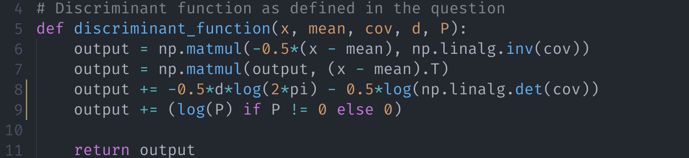

<h1>
    
CS4023D Artificial Intelligence

    
Assignment 2

</h1>

By Dev Sony, B180297CS

The question, report and source code can be found here.

[Github Repo]()

## Solution 1

Based on the formula given:

The function has been defined:

The variables can be configured based on the scenario. Here, it's assumed that prior probabilities are equally distributed and all features are taken: 

The input is the sample dataset, each set separated by the class they belong to as given below:

In order to classify the sample data, we first run the function through our sample dataset, classwise. On each sample, we find the class which gives the maximum output from its discriminant function. 

A count and total count is maintained in order to find the success and failiure rates.

Assuming that all classes have an equal prior probability (as per the configuration in the example picture), the following output is produced:

## Solution 2

### Part (a) and (b)
In order to match the question, the configuration variables are altered. 

- (data-1) for n indicates that only 2 classes will be considered (the final class would not be considered as its Prior probability is 0, implying that it wouldn't appear.)
- The d value is changed to 1, indicating that only 1 feature will be used. (which is x1)

The configuration parameters being passed are also changed.

- x\[0] indicates that only x^1 will be used.
- means\[i]\[0] indiciates that we need the mean only for x1).
- cov\[i]\[0]\[0] indicates the variance of feature x1).

This results in the following output:

### Part (c)

Here, the configuration parameters are changed slightly.

- 'd's value is changed to 2, as now we are considering the first and second features.
- The matrix paramateres passed now include necessary values for the same reason.

This results in the following output:

### Part (d)

Here again, the configurations are changed in a similiar fashion as in (c).

- 'd' values is changed to 3 as all three features are now considered.
- The matrix paramaeteres are now passed without slicing as all values are important.

The resuls in the following output:

### Part (e)

On comparing the three outputs, using one or three features give more accurate results than using the first and second features.

The reason for this could be because the covariance with the third feature is much higher than the ones associated with the second feature.

### Part (f)

In order to consider the possible configurations mentioned, the code takes an input vector and goes through all of them.

Here are the outputs for the 4 input vectors mentioned in the question:

