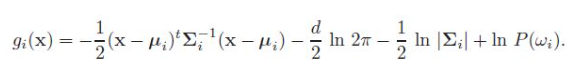
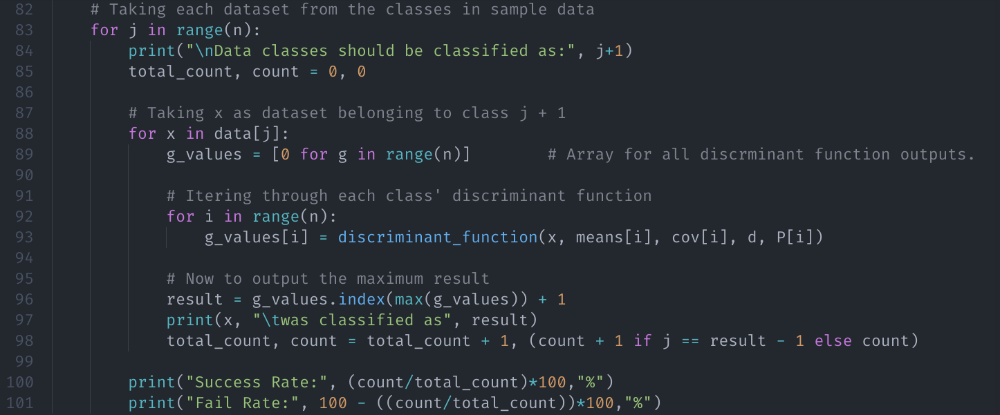
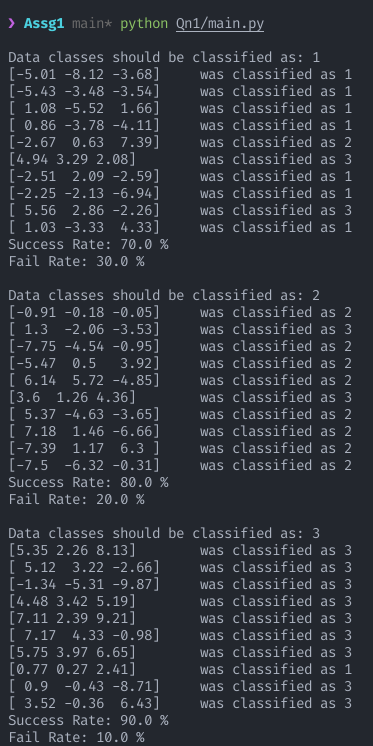

<h1>
    
CS4023D Artificial Intelligence

    
Assignment 2

</h1>

By Dev Sony, B180297CS

The question, report and source code can be found here.

[Github Repo]()

## Solution 1

Based on the formula given:

The function has been defined:

The variables can be configured based on the scenario: 

The input is the sample dataset, each set separated by the class they belong to as given below:

In order to classify the sample data, we first run the function through our sample dataset, classwise. On each sample, we find the class which gives the maximum output from its discriminant function. 

A count and total count is maintained in order to find the success rates.

Assuming that all classes have an equal prior probability (as per the configuration in the example picture), the following output is produced:

